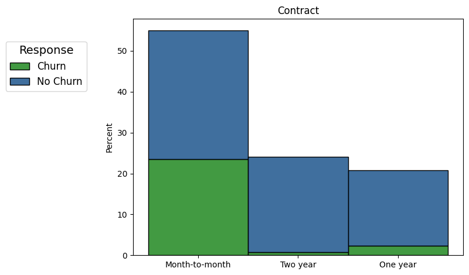
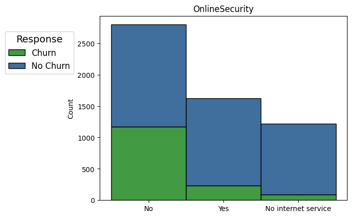
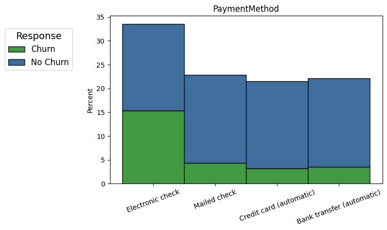
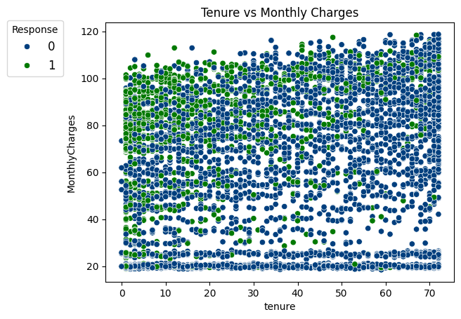
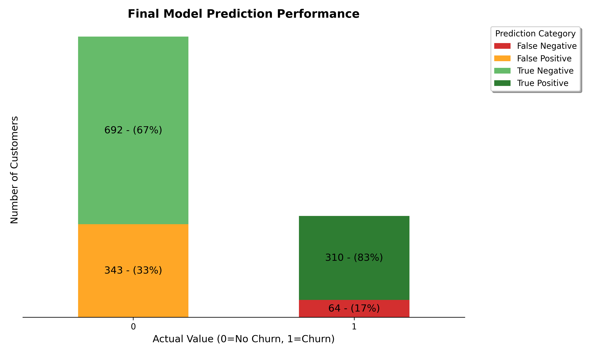

# Projeto de Previsão de Churn de Clientes de Telecomunicações

# Problema de Negócio
Uma empresa de telecomunicações enfrenta o desafio de alta rotatividade de clientes (churn), que impacta diretamente na receita e nos custos operacionais. Com a competição acirrada no setor, identificar clientes em risco de cancelamento tornou-se crucial para implementar estratégias de retenção eficazes antes que seja tarde demais.

# Objetivo
Desenvolver um modelo de Machine Learning capaz de identificar clientes com alta probabilidade de cancelar o serviço, permitindo que a equipe de retenção foque seus esforços nos clientes certos no momento certo, maximizando a taxa de sucesso das ações preventivas.

# Produto Final
Um modelo preditivo que analisa o comportamento e características dos clientes para gerar um score de risco de churn. Este modelo permite à empresa priorizar ações de retenção, otimizar investimentos em campanhas e reduzir significativamente a perda de receita por cancelamentos.

## [Link para o Notebook do Projeto](notebooks/project.ipynb)
  

# Planejamento da Solução

## 1. Compreensão do Negócio
- **Definição do problema de negócio:** A empresa precisa identificar proativamente clientes em risco de churn para implementar estratégias de retenção direcionadas, reduzindo a perda de receita e otimizando custos de aquisição.
- **Planejamento da abordagem e do resultado esperado:** Desenvolver um modelo que ranqueie clientes por risco de churn, permitindo ações preventivas focadas nos casos de maior probabilidade.

## 2. Compreensão dos Dados
- **Análise exploratória para identificar padrões de comportamento:** Investigação detalhada dos dados de clientes para entender fatores que influenciam o churn, incluindo perfil demográfico, padrões de uso e características contratuais.
- **Geração de insights estratégicos:** Identificação de segmentos de alto risco e oportunidades de melhoria nos produtos e serviços oferecidos.

## 3. Preparação dos Dados
- **Engenharia de features para capturar comportamentos relevantes:** Criação de variáveis que representem melhor o relacionamento cliente-empresa e padrões de uso dos serviços.
- **Tratamento de dados categóricos e numéricos:** Aplicação de técnicas de encoding e normalização para otimizar o desempenho dos modelos preditivos.

## 4. Modelagem
- **Teste de diferentes algoritmos de Machine Learning:** Avaliação de múltiplos modelos incluindo Regressão Logística, Random Forest e XGBoost para identificar a melhor abordagem.
- **Otimização focada em recall:** Priorização da capacidade de identificar corretamente clientes em risco, mesmo que isso resulte em alguns falsos positivos, pois é melhor abordar um cliente que não cancelaria do que perder um que realmente cancelaria.

## 5. Avaliação
- **Métricas orientadas ao negócio:**
  - **Recall:** Capacidade de identificar corretamente clientes que realmente irão cancelar
  - **Precision:** Eficiência na identificação de clientes em risco
  - **F1-Score:** Equilíbrio entre precisão e recall
  - **AUC-ROC:** Capacidade geral de discriminação do modelo

## 6. Interpretação e Recomendações
- **Análise dos fatores de risco:** Identificação das variáveis mais importantes para o churn, fornecendo insights actionáveis para a área de negócio.
- **Estratégias de retenção direcionadas:** Recomendações específicas baseadas nos padrões identificados pelo modelo.

  

# Principais Insights

### 1. Clientes com contratos mensais têm risco muito maior de churn
Clientes com contratos mês-a-mês apresentam taxa de churn significativamente superior comparado a contratos anuais ou bi-anuais, indicando que a flexibilidade contratual pode ser um fator de risco.

### 2. Ausência de serviços adicionais aumenta drasticamente o risco
Clientes que não possuem serviços de segurança online, backup, proteção de dispositivos ou suporte técnico têm probabilidade muito maior de cancelamento, sugerindo que esses serviços aumentam o valor percebido.

### 3. Método de pagamento impacta na retenção
Clientes que pagam via cheque eletrônico apresentam maior taxa de churn comparado àqueles que usam métodos automáticos como cartão de crédito ou débito automático.

### 4. Valor mensal e tempo relacionamento
Quanto maior o valor da mensalidade e menor o tempo de vínculo maior a probabilidade do cliente entrar em churn.

  

# Machine Learning

## Modelos Utilizados e Resultados

Para este projeto de churn, o **recall** foi priorizado como métrica principal, pois é mais custoso para o negócio não identificar um cliente que realmente irá cancelar do que abordar preventivamente um cliente que não cancelaria.

| Modelo                | Precision | Recall | F1-Score | AUC-ROC |
|----------------------|-----------|--------|----------|---------|
| **XGBoost**          | **47%**   | **83%**| **60%**  | **0.83**|
| Regressão Logística  | 53%       | 80%    | 63%      | 0.84    |
| Random Forest        | 55%       | 70%    | 61%      | 0.83    |

---

## Escolha do Modelo Final
O **XGBoost** foi selecionado como modelo final por apresentar o **maior recall (83%)**, conseguindo identificar corretamente 310 dos 374 clientes que realmente cancelaram o serviço. 

Embora tenha menor precisão que os outros modelos, essa característica é desejável no contexto de churn, onde:
- O custo de perder um cliente é muito maior que o custo de uma abordagem preventiva desnecessária
- Ações de retenção bem estruturadas podem converter até mesmo clientes que não estavam planejando cancelar
- A priorização do recall maximiza a proteção da base de clientes

---

## Validação e Generalização
O modelo foi validado através de:
- **Validação cruzada** com 5 folds para garantir robustez
- **Teste em dados não vistos** durante o treinamento
- **Ajuste de hiperparâmetros** via Grid Search otimizado para recall

Os resultados consistentes em dados de teste confirmam que o modelo generaliza bem para novos dados.

  

# Impacto no Negócio

## Resultados Esperados
Com o modelo XGBoost implementado, a empresa pode:

- **Identificar 83% dos clientes em risco** de churn antes que cancelem
- **Focar ações de retenção** nos clientes com maior probabilidade de cancelamento
- **Reduzir significativamente a perda de receita** através de intervenções preventivas
- **Otimizar investimentos** em campanhas de retenção, direcionando recursos para casos de maior impacto

## Estratégias de Retenção Recomendadas
Baseado nos insights do modelo:

1. **Migração para contratos anuais:** Oferecer incentivos para clientes migrarem de contratos mensais
2. **Upselling de serviços adicionais:** Focar na venda de serviços de segurança e suporte técnico
3. **Facilitação de pagamentos automáticos:** Incentivar métodos de pagamento mais estáveis
4. **Campanhas familiares:** Desenvolver ofertas direcionadas para núcleos familiares

  

# Conclusão e Próximos Passos

## Conclusão
O projeto demonstrou que é possível identificar proativamente clientes em risco de churn com alta precisão. O modelo XGBoost alcançou **83% de recall**, permitindo à empresa identificar a grande maioria dos clientes que realmente cancelariam seus serviços.

Os insights gerados fornecem direcionamento claro para estratégias de retenção, focando em aspectos como tipo de contrato, serviços adicionais e métodos de pagamento.

---

## Próximos Passos

1. **Implementação em produção**
   - Deploy do modelo em ambiente de produção para scoring em tempo real
   - Integração com sistemas de CRM para automação de campanhas

2. **Monitoramento e refinamento**
   - Acompanhamento da performance do modelo com dados novos
   - Re-treinamento periódico para manter a acurácia

3. **Expansão da estratégia**
   - Desenvolvimento de modelos específicos por segmento de cliente
   - Criação de modelos de valor de cliente (CLV) para priorização adicional

4. **Teste de estratégias**
   - Implementação de testes A/B para validar efetividade das ações de retenção
   - Mensuração do ROI das campanhas direcionadas pelo modelo

---

**Desenvolvido por:** Rafael Luckner
